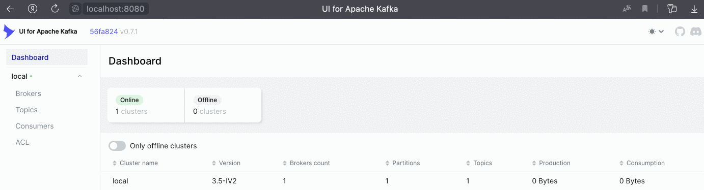

# Реализация Kafka на Go

Простая реализация _Kafka_ на _Golang_ с использованием пакета [kafka-go](https://github.com/segmentio/kafka-go) и [UI for Apache Kafka](https://github.com/provectus/kafka-ui). 

> [!NOTE]
>Apache Kafka — это Open Source-платформа для распределенной потоковой передачи событий. Ее задача — организация  высокопроизводительных пайплайнов данных, потоковая аналитика, интеграция данных.

> [!NOTE]
>UI for Apache Kafka — это веб-сервис с открытым кодом и понятным пользовательским интерфейсом для работы с кластерами Apache Kafka. Он позволяет разработчикам отслеживать потоки, находить и устранять проблемы с данными.

## Запуск программы и контейнера

Клонируйте репозиторий:

    % git clone https://github.com/SahaGo/Learning_Kafka_proj.git

Для сборки docker-compose.yml перейдите в директорию проекта и в терминале запустите:

    % docker-compose up


Затем в текущей директории запустите приложения командой:

    % go build

Параллельно в браузере перейдите на ```http://localhost:8080/```, где будет доступен интерфейс UI for Apache Kafka. Следуя шагам по картинке откройте LiveMode для отслеживания событий в реальном времени.



Программа открывает два канала, управляющих работой горутин и запускает две асинхронные горутины, далее происходит ожидание `time.Sleep` в 30 секунд. 

За отведенное время Producer по `time.Ticker` создает событие, отправляет в топик "testTopic" в формате JSON и выводит мини-отчет о количестве отправленных событий, а Consumer читает эти события из Кафки и выводит в консоль значения Offset, Key, Value и целиком полученную модель JSON. 

По истечению таймера в каждый канал поступает сигнал завершить соответствующую горутину. Операции завершения горутин и закрытия каналов сопровождаются информационными сообщениями.

